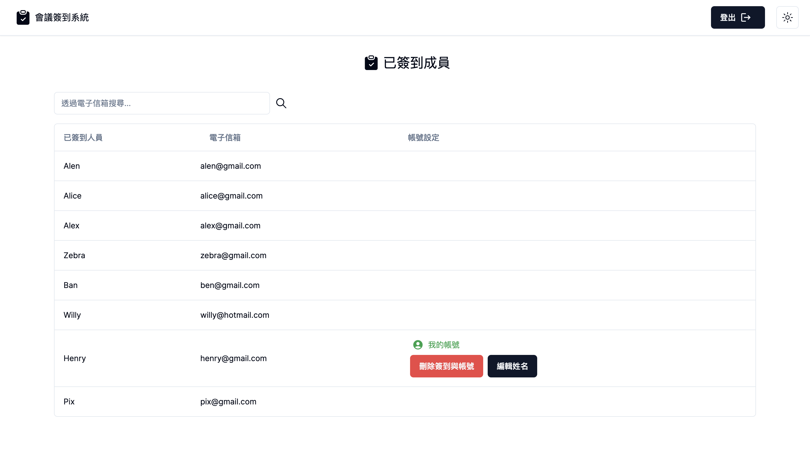
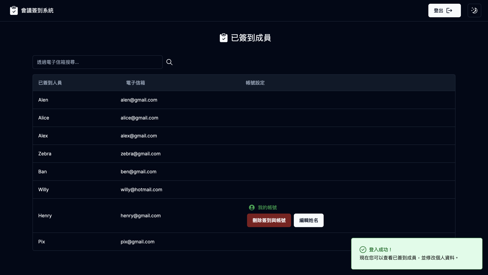
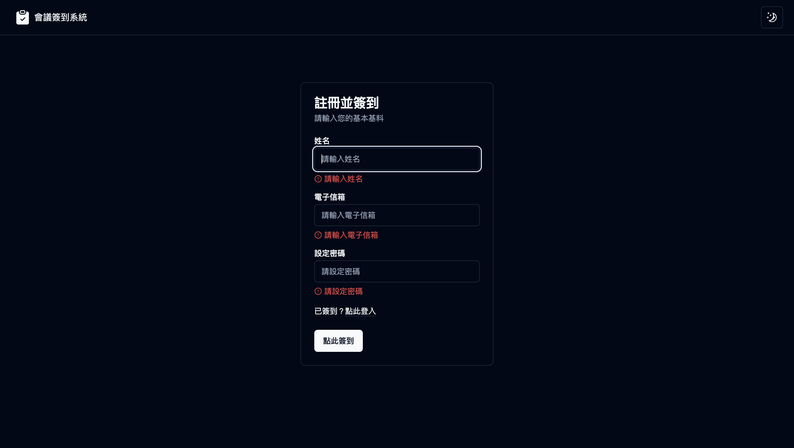
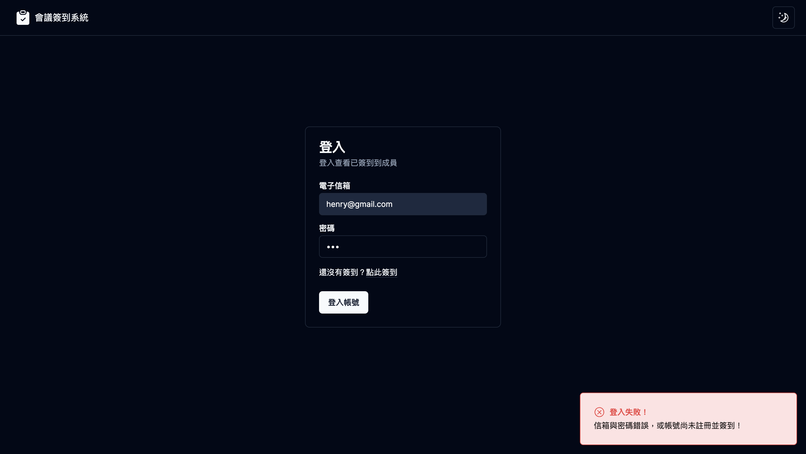
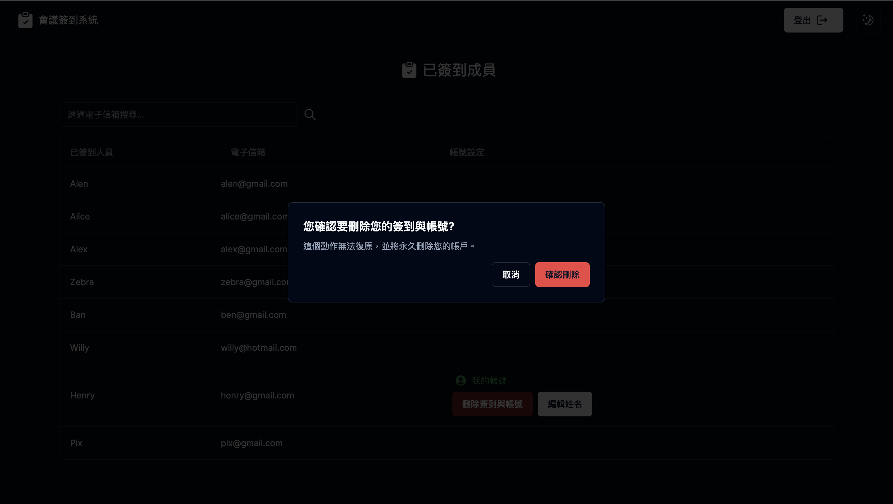

# 會議簽到系統

## 前端環境

使用 Express.js 實作 RESTful API 並實現前後端分離架構，此為前端環境

## 關於會議簽到系統

前端：

1.使用 Next.js 14 ( App Router )、React Hook、TypeScript 開發全站  
2.使用 shadcn/ui 引入元件、實現 Dark Mode 切換  
3.使用 SWR 完成 CSR 並實現 cache  
4.使用 Zeabur 完成部署
5.Repo:https://github.com/chingwu99/rest-api-demo-frontend
6.Demo:https://rest-api-demo-frontend.zeabur.app/  
7.測試帳號：henry@gmail.com  
8.測試密碼：11111111

後端：

1.使用 Express.js、TypeScript 建立後端環境  
2.使用 Mongoose 作為與 MongoDB 串連的 ODM 完成 NoSQL 操作  
3.製作 RESTful API

註冊並簽到 POST /auth/register
登入 POST /auth/login
已簽到成員 GET /users
刪除簽到 DELETE /users/:id
編輯姓名 PATCH /users/:id

4.使用 Zeabur 完成部署
5.Repo:https://github.com/chingwu99/rest-api-demo
6.Demo:https://rest-api-demo.zeabur.app/
